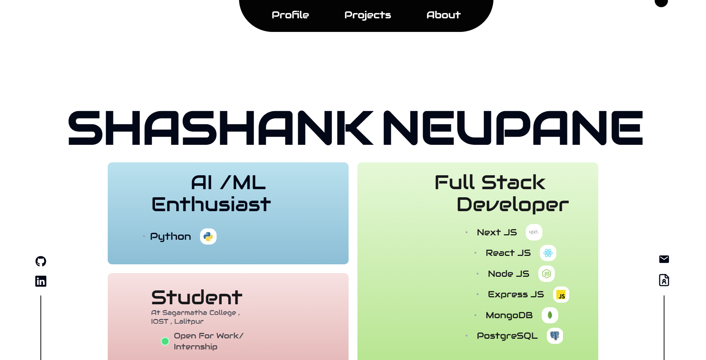

# Portfolio Website



Welcome to my portfolio! This repository contains the source code for my personal portfolio website, built to showcase my skills, projects, and experiences as a Full-stack Web Developer and AI enthusiast.

## 🚀 Technologies Used

This project is built with the following technologies:

- **Next.js** – for server-side rendering and static site generation.
- **React** – for building interactive UI components.
- **TypeScript** – for type-safe and scalable development.
- **Tailwind CSS** – for rapid and responsive styling.
- **Acertinity UI** – for beautiful and reusable UI components.
- **Framer Motion** – for smooth animations and interactive UI effects.

## ✨ Features

- Fully responsive design for a seamless experience on all devices.
- Showcases my skills, projects, and resume.
- Interactive animations and smooth user experience.
- SEO-optimized for better search engine visibility.
- Fast loading times with Next.js static optimization.

## 📦 Installation & Setup

To run this project locally, follow these steps:

1. **Clone the repository**
   ```sh
   https://github.com/shashankneupane0427/Portfolio-Website.git
   ```

2. **Install dependencies**
   ```sh
   npm install
   # or
   yarn install
   ```

3. **Run the development server**
   ```sh
   npm run dev
   # or
   yarn dev
   ```

4. Open `http://localhost:3000` in your browser to view the portfolio.

## 🛠 Deployment

This portfolio is deployed using **Vercel** with a custom domain: **[suryashashank.com.np](https://suryashashank.com.np)**.

## 📜 License

This project is licensed under the **MIT License** 

## 📬 Contact

If you have any questions or want to collaborate, feel free to reach out:
- **Email:** your-email@example.com
- **LinkedIn:** [Your LinkedIn Profile](https://www.linkedin.com/in/shashankneupane0427/)
- **Website:** [Your Portfolio](https://suryashashank.com.np)

Thank you for visiting! 🚀

